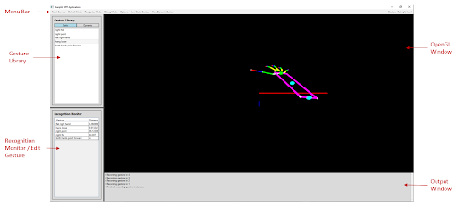
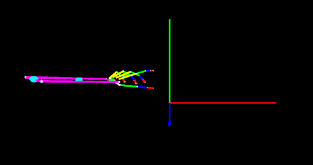
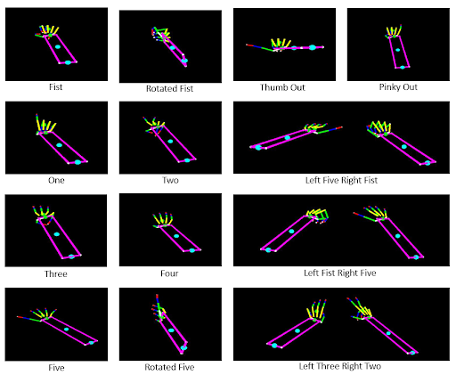
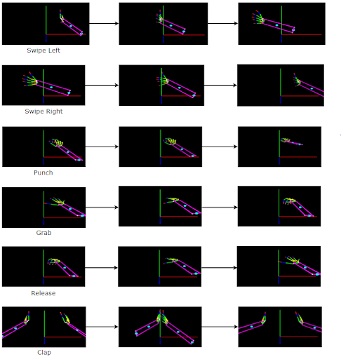

# leap-gesture-recognition
Application that recognizes and learns gestures using the Leap Motion Controller.

Project done for Master of Science in Computer Science, California State University, Northridge:
http://scholarworks.csun.edu/bitstream/handle/10211.3/171810/Dimartino-Michael-thesis-2016.pdf

### Screenshots

